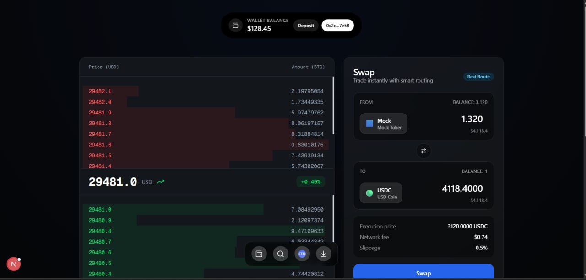
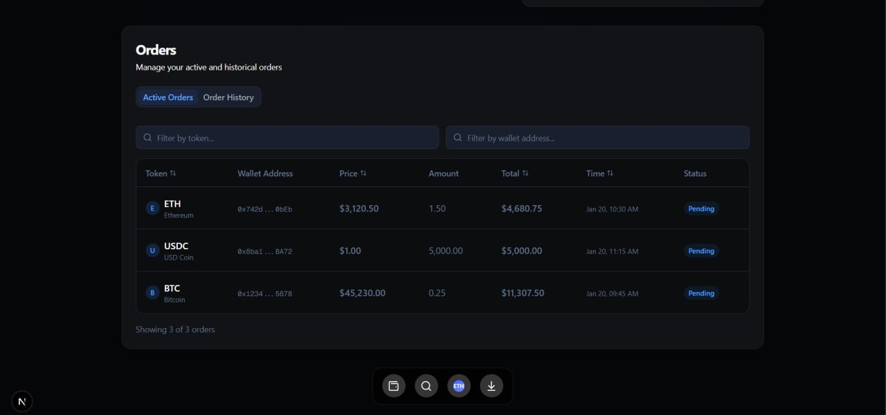
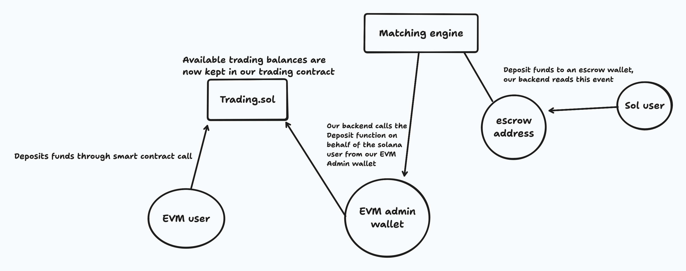
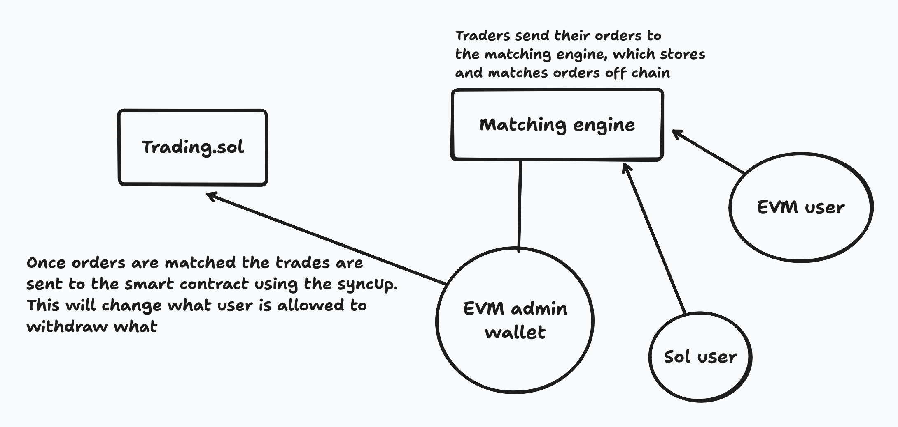

<h1 align="center">
🐒🐒🐒 Macaque 🐒🐒🐒
</h1>

<h4 align="center">
  

    
  

  <a href="https://sloths-warsaw.vercel.app/">Website</a>
</h4>

🐒 Macaque is a decentralized software stack that allows anyone to spin up their own Macaque Virtual Trading Chain (MVTC), completely chain and chain architecture agnostic. Building with this stack, builders can offer users slippage free cross chain trading at CEX level speed, with DEX level certainty.

- 💅 **Off-chain execution, on chain bookkeeping**: Orders a sent and matched within our off chain matching engine, and through the power of Vincent, we can orchestrate sophisticated fund managements, while bookkeeping everything transparently.
- ⛓️ **No more unnecessary dappchains**: Thanks to the power of EVVM, each MVTC is deployed as a virtual blockchain within a smart contract, running on an already existing EVM, minimizing the ever growing chain fragmentation problem
- 🤑 **No slippage**: Since we're matching all orders through a CLOB, users can trade safely knowing that they won't suffer any loss of funds due to slippage.
- 🌉 **Interops with already existing crosschain standards**: Since we're building Macaque from the ground up to be crosschain, we are fully utilizing [the CAIP10 standard](https://chainagnostic.org/CAIPs/caip-10)

## 🪏 Deeply integrated into the EVVM

Since MVTC's are app chains, we needed our functionality to play well along side the already existing infrastructure EVVM has. We also wanted to work some of our incentive mechanism to play well together with the EVVM mechanisms. Here are the ways that we try to utilize the EVVM to the maximum:
1. CAIP10 - we extended the core EVVM contracts to work with CAIP10 addresses, since this was needed for our bookkeeping.
2. EVVM Naming Service - our contracts are utilizing the EVVM Naming Service which can be used to set the evm withdrawal address.
3. Discount for EVVM stakers - for the real OGs that are staking on EVVM, they can enjoy 50% off on the fees, which are drawn on withdrawal.

## Screenshots:
| Landing Page                      | Order Book                        |
| --------------------------------- | --------------------------------- |
|     |     |

## Diagrams
### Deposit

### Trading

## Bounties 😎

### Lit Protocol - Best DeFi automation Vincent Apps
This is a cross chain first dapp, and we've used Lit Protocols Vincent platform to be able to operate across multiple chain architecture

### EVVM - Most Innovative Use of EVVM’s Execution Function
Our whole system is deeply integrated into the EVVM, and we've included functions following the executor model.

## Next steps

- We want to bring this tool primarly in the hands of hackathons in order for hackers to be able get a picture of the credibility of a company and wether or not they are likely to pay the bounties to the winning hackers.

## Links

- [Github](https://github.com/ETHOnline2025)
- [Vercel](https://sloths-warsaw.vercel.app/)
- [Eth Global Submission](https://devfolio.co/projects/sloth-shaming-bea7)

### Deployments Base sepolia
- [Trading](https://sepolia.basescan.org/address/0x55555edf4395f6ca0b2385568ccae1fb738d3650)
- [EVVM](https://sepolia.basescan.org/address/0xa25d6b39e757ace76840ac7a4bc6f7356de70224)
- [Staking](https://sepolia.basescan.org/address/0xd4454caa1ac67072199e55439f7beba87aa4a4f7)
- [NameService](https://sepolia.basescan.org/address/0x0ca5d9906e6da8d05aca2caf6ce8b8a5ed413cb2)
- [Treasury](https://sepolia.basescan.org/address/0x2d2ebbd9863631da6f0aa87f844f37e8b96e3323)

## Team

- [0xshazam.eth](https://x.com/0xshazam)
- [0xjsi.eth](https://x.com/0xjsieth)
- [nhestrompia.eth](https://x.com/nhestrompia)
- [parham](https://x.com/khodedawsh)
